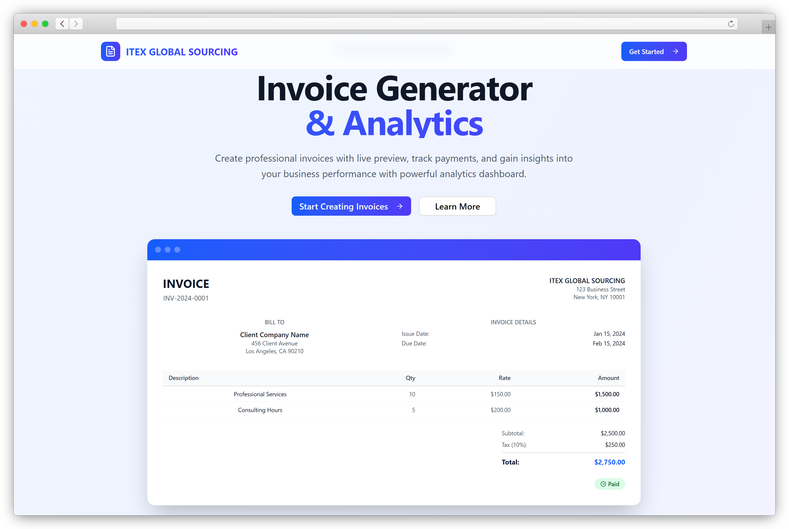

<div align="center">

# ITEX Invoice Generator

Modern React + Convex app for generating invoices, proformas, challans, and more—styled with Tailwind v4 and shadcn/ui, animated with Framer Motion, and ready for local and cloud.



</div>

## Table of Contents

- Quick Start
- Environment Variables
- Authentication (important)
- Project Scripts
- Tech Stack
- Project Structure
- Conventions (UI, routing, theming)
- Using Convex (schema, actions, gotchas)
- Build, Preview, and Optional Deno Serve
- Troubleshooting

## Quick Start

Prerequisites:
- Node.js 20+ and pnpm
- A Convex account (we’ll use npx so no global install needed)
- On Windows: Git Bash or WSL (for the provided bash script), otherwise use the manual steps below

1) Install dependencies

```powershell
pnpm install
```

2) Start Convex dev (keep this running in its own terminal)

```powershell
npx convex dev
```

This opens a browser to sign in and prints a local Convex URL, e.g. http://127.0.0.1:3632.

3) Create client env file (.env.local) for Vite

```dotenv
VITE_CONVEX_URL=http://127.0.0.1:3632
CONVEX_DEPLOYMENT=dev
```

4) Configure Convex server env (Auth)

The backend needs these variables: `JWKS`, `JWT_PRIVATE_KEY`, and `SITE_URL`.

- Option A (recommended): run the helper script with Git Bash/WSL

```bash
bash set-convex-jwt-env.sh
```

- Option B (manual, PowerShell-friendly): set them with Convex CLI

```powershell
npx convex env set JWKS "<your_jwks_or_public_keys_json>"
npx convex env set JWT_PRIVATE_KEY "<your_private_key_pem_or_jwk>"
npx convex env set SITE_URL "http://localhost:5173"
```

5) Run the Vite dev server (new terminal)

```powershell
pnpm dev
```

Open http://localhost:5173 and go to /auth to sign in (email OTP + anonymous are supported).

## Environment Variables

Client-side (.env.local):
- `VITE_CONVEX_URL` — Must match the URL printed by `npx convex dev`.
- `CONVEX_DEPLOYMENT` — Typically `dev` for local.

Convex server-side (managed via `npx convex env set`):
- `JWKS` — JSON Web Key Set; used to validate tokens.
- `JWT_PRIVATE_KEY` — Private key for issuing tokens in flows that need it.
- `SITE_URL` — Base app URL, e.g. http://localhost:5173.

## Authentication (important)

Auth is fully wired up with Convex Auth using email OTP and anonymous sessions.

- Don’t modify: `src/convex/auth/emailOtp.ts`, `src/convex/auth.config.ts`, `src/convex/auth.ts`.
- Frontend auth hook: `useAuth` from `@/hooks/use-auth`.

Example:

```ts
import { useAuth } from "@/hooks/use-auth";
const { isLoading, isAuthenticated, user, signIn, signOut } = useAuth();
```

Protected routes: use `useAuth` to gate and redirect to `/auth`.

After successful auth: add your post-login redirect in `src/main.tsx`.

## Project Scripts

Defined in `package.json`:

- `pnpm dev` — Start Vite dev server
- `pnpm build` — Type-check and build production assets
- `pnpm preview` — Preview built assets locally
- `pnpm lint` — Lint the project
- `pnpm format` — Run Prettier

## Tech Stack

- Vite + TypeScript
- React 19 + React Router v7 (import from `react-router`)
- Tailwind v4 + shadcn/ui (Radix primitives)
- Lucide Icons
- Convex (backend + DB) + Convex Auth
- Framer Motion
- Three.js

## Project Structure

Key paths:

- `src/` — App code (pages, components, hooks, lib)
- `src/components/ui` — shadcn/ui primitives
- `convex/` — Convex backend (schema, functions, auth config)
- `public/` — Static assets (logos, icons)
- `main.ts` — Optional Deno static server for the built app

## Conventions (UI, routing, theming)

- Pages in `src/pages`; wire new routes in `src/main.tsx`.
- shadcn/ui primitives live under `src/components/ui` and should be used by default.
- Keep designs mobile-first and responsive. Use container widths to avoid stretched layouts.
- Prefer minimal borders over heavy shadows; avoid nested cards.
- Use `cursor-pointer` on clickable elements; headings should use `tracking-tight font-bold`.
- Use Sonner toasts for feedback: `import { toast } from "sonner"`.
- Use Framer Motion for animations (fade/slide in/out, render transitions, button taps).
- Theme and colors: change in `src/index.css` (oklch variables) and shared UI primitives.

## Using Convex

Schema: `convex/schema.ts` (don’t duplicate `_creationTime` indexes; don’t include `_id`/`_creationTime` in documents you write).

Actions vs queries/mutations:
- External calls must use Actions with `"use node"` at the file top.
- Don’t mix queries/mutations in the same file that has `"use node"`.

CRUD helpers example (internal use):

```ts
// convex/users.ts
import { crud } from "convex-helpers/server/crud";
import schema from "./schema";
export const { create, read, update, destroy } = crud(schema, "users");
```

Common gotchas:
- Use `_id` for document IDs and `Id<"Table">` types (not `string`).
- Use `Doc<"Table">` for document shapes.
- Keep `schemaValidation` false in the schema file.
- Handle `null | undefined` from queries on both frontend and backend.
- Use aliased imports like `@/convex/_generated/api` and `@/convex/_generated/server`.
- Import `useQuery`, `useMutation`, `useAction` from `convex/react`.

## Build, Preview, and Optional Deno Serve

Build:

```powershell
pnpm build
```

Preview the built app:

```powershell
pnpm preview
```

Serve with Deno (optional, after `pnpm build`):

```powershell
# Requires Deno installed
deno run -A main.ts
```

## Troubleshooting

- “VITE_CONVEX_URL not set”: ensure `.env.local` matches the URL printed by `npx convex dev`.
- Auth errors (bad/missing keys): set `JWKS`, `JWT_PRIVATE_KEY`, and `SITE_URL` using the script or manual CLI.
- Type errors with IDs: ensure you’re using `Id<"Table">` and `_id` rather than `string` and `id`.
- Windows + bash script: run `set-convex-jwt-env.sh` from Git Bash/WSL, or set vars with `npx convex env set`.
- Query returning null/undefined: handle defensive checks in UI and server code to satisfy TypeScript.

---

If you want me to point the favicon to a local asset instead of the remote URL in `index.html`, or to add CI, tests, or deployment docs, say the word and I’ll wire it up.
